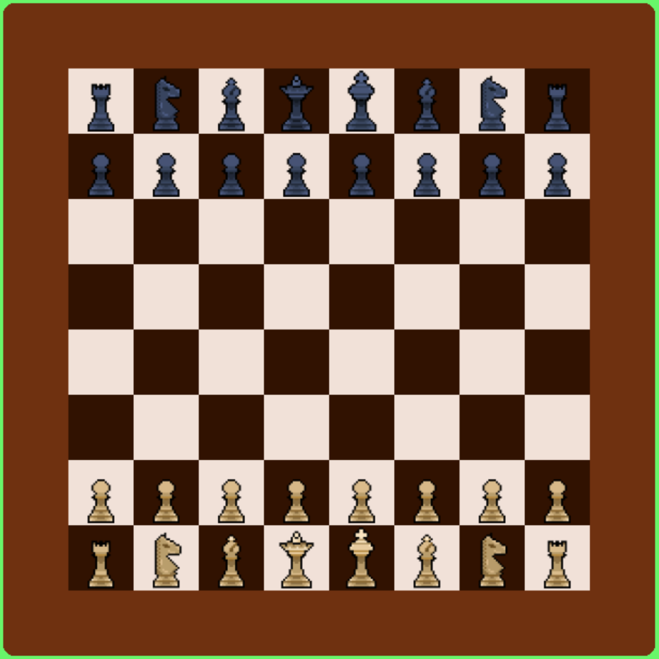

# Chess

### [Download](https://github.com/C-users-quad/chess/releases/latest)

    
     
    <em>The in-game board</em>

## Overview

A simple pass-n-play style chess game in python + pygame.

## Controls

 - ESC to exit menus
 - Mouse input for everything else

## Build instructions

 1. Download source files from latest release and extract
 2. Change directory to extracted project folder
 3. run `just install` then
     - if u wanna just compile and run: `just run`
     - if u wanna make executable: `just export`
